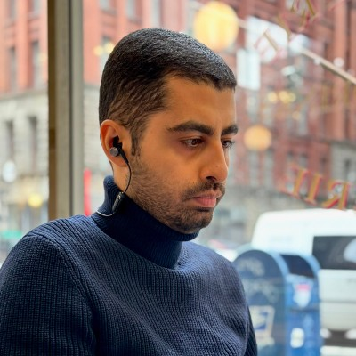

**Machine Learning & AI Engineer**

---

## About

I'm an ML/AI engineer passionate about building intelligent systems, from handwritten digit recognition with PyTorch to LLM-powered applications and data analysis pipelines. I enjoy working at the intersection of research and engineering, turning ideas into reproducible, well-documented code.

---

## Projects

### ◼️ [TelRag.site](https://telrag.site)
RAG application, using telegram as a tool for adding new documents.

### ◼️ [DigitRecognition](https://github.com/gitFarzam/DigitRecognition)
Recognition of handwritten digits using **PyTorch** combined with simple image segmentation techniques.

### ◼️ [LLM Projects](https://github.com/gitFarzam/llm)
Experiments and projects related to large language model design and fine-tuning.

### ◼️ [LangChain Notebooks](https://github.com/gitFarzam/langchain)
Hands-on explorations of the LangChain framework for building LLM-powered applications.

### ◼️ [Data Analysis Notebooks](https://github.com/gitFarzam/notebooks)
A collection of Jupyter notebooks for analyzing and visualizing datasets.

---

## Skills

| Area | Technologies |
|------|-------------|
| **Machine Learning** | PyTorch, scikit-learn, neural networks, image segmentation |
| **LLMs & AI** | LangChain, prompt engineering, LLM design |
| **Data Science** | Jupyter, pandas, data visualization, EDA |
| **Languages** | Python, SQL |
| **Version Control** | Git, GitHub |

---

## Get in Touch

- ◼︎ [LinkedIn](https://www.linkedin.com/in/farzamarefi/)
- ◼︎ [GitHub](https://github.com/gitFarzam)
